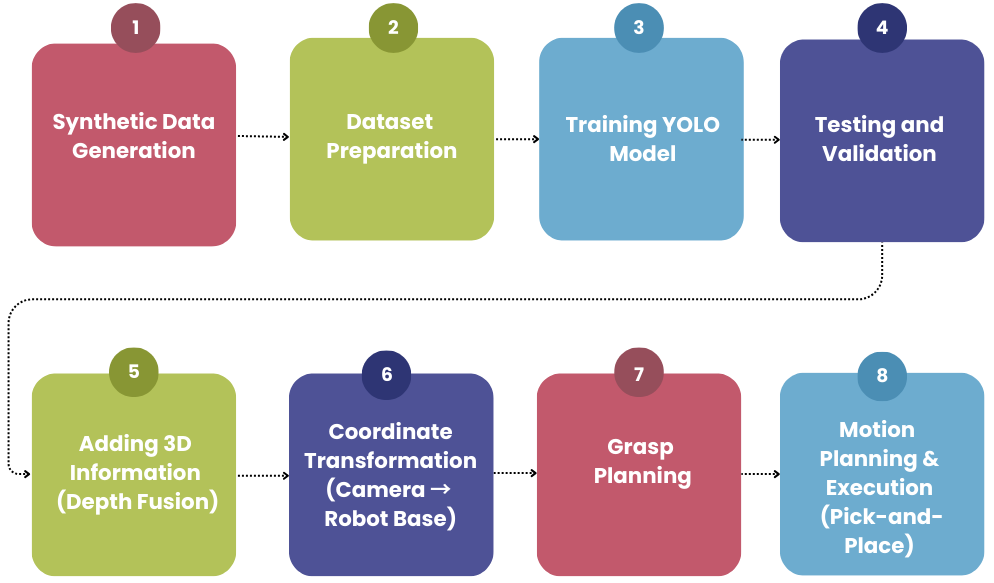
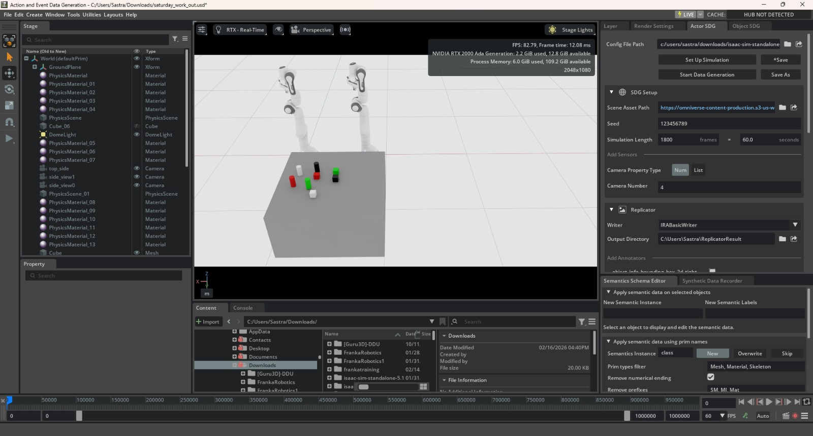
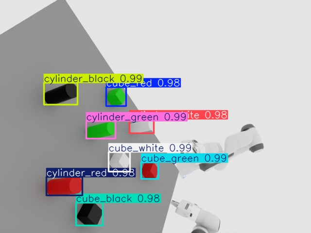
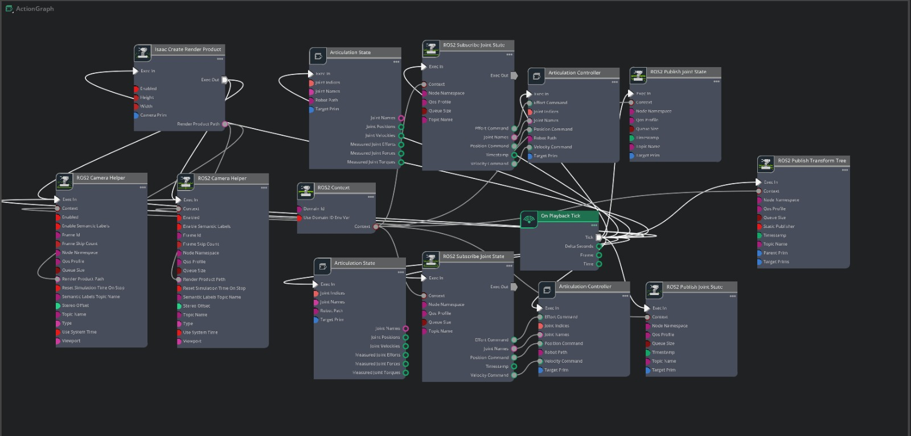

# dual-arm-vision-pick-place
AI-guided vision system for a dual-arm robotic manipulator using YOLOv8 for object detection, pose estimation, and automated pick-and-place operation.

## YOLOv8 mini-project

A starter computer-vision project for the mini project **AI-Based Vision Guided Pick-and-Place Robot (Dual-Arm Manipulator)**. It trains a YOLOv8 detector on RGB images and YOLO bounding-box labels exported from NVIDIA Isaac Sim, evaluates the trained model, and runs detection on new images.

This project implements the vision and object-detection part of the system. Converting image detections into 3D grasp poses and synchronizing physical robot arms are separate integration steps.

## System overview

The review materials describe an end-to-end simulation workflow:

1. Create a dual-arm scene and RGB-D camera in NVIDIA Isaac Sim; generate or capture images and prepare YOLO-format labels.
2. Train and validate YOLOv8 to detect cubes and cylinders by shape and color.
3. Subscribe to the simulated RGB and depth streams through ROS 2. Use each detection's image-space center and corresponding depth to estimate a 3D point in the camera frame.
4. Transform that point into the robot base frame with ROS 2 TF, then calculate target joint angles with MATLAB inverse kinematics for pick-and-place motion.

The pinhole-camera back-projection used to turn a pixel and its depth into a camera-frame point is:

```text
X = (u - cx) * Z / fx
Y = (v - cy) * Z / fy
Z = depth(u, v)
```

Here `(u, v)` is the pixel coordinate, `Z` is its depth, `(cx, cy)` is the camera principal point, and `(fx, fy)` are the focal lengths in pixels. The depth image and RGB detections must be aligned, and the camera intrinsics and TF frame direction must match the simulated camera.

The slides report that the workflow was exercised in Isaac Sim, including YOLO detections, depth-based position estimates, camera-to-base transforms, and MATLAB IK. They also describe debugging data flow and frame-alignment issues, and switching from MoveIt IK attempts to MATLAB calculations. These are project-review results, not benchmark claims: the charts in the slides do not establish generalization or real-robot performance.

**Repository scope:** `train.py`, `validate.py`, and `predict.py` provide the runnable YOLO training, evaluation, and image-inference starter. The ROS 2 graph/nodes, Isaac Sim scene, depth-to-world integration, and MATLAB IK shown in the review materials are not included as executable project files here. Robot-control integration and real-hardware validation remain separate work.

### Figures from the project review

**Perception-to-action workflow**



**Isaac Sim scene and example detections**





**Integration and motion-planning illustrations**




### Video walkthroughs

Open a clip to watch the corresponding project demonstration:

- [Pick-and-place demonstration](docs/videos/pick-and-place.mp4) — robot pick-and-place sequence.
- [Simulation walkthrough](docs/videos/simulation-walkthrough.mp4) — project simulation demonstration.
- [YOLO detection demonstration](docs/videos/yolo-detection.mp4) — object detection in the scene.

On GitHub, select a video link to open the clip in the repository's video viewer.

### Requirements

- Python 3.9 or later
- Isaac Sim RGB images and matching YOLO-format label files
- NVIDIA GPU is optional; training can also run on CPU

### Project layout

```text
.
├── dataset/
│   ├── images/
│   │   ├── train/
│   │   └── val/
│   └── labels/
│       ├── train/
│       └── val/
├── runs/                       # Generated training and prediction results
├── dataset.yaml
├── train.py
├── validate.py
├── predict.py
├── requirements.txt
└── docs/
    ├── images/                 # Figures from the project review
    └── videos/                 # Project walkthrough clips
```

Place each image in the appropriate `images` directory and its label file in the matching `labels` directory. For example:

```text
dataset/images/train/cube_001.jpg
dataset/labels/train/cube_001.txt
```

Each label file contains one object per line:

```text
class_id x_center y_center width height
```

The four box values must be normalized to the range 0–1. Empty label files are valid for images with no objects. The class IDs must match the names and order in `dataset.yaml`.

### Install

From the repository root, create and activate a virtual environment (recommended), then install the dependencies:

```powershell
py -m venv .venv
.\.venv\Scripts\Activate.ps1
python -m pip install --upgrade pip
pip install -r requirements.txt
```

### Train

```powershell
python train.py
```

By default, training starts from `yolov8n.pt`, uses `dataset.yaml`, and saves outputs under `runs/detect/mini_project_yolov8/`. The best checkpoint is:

```text
runs/detect/mini_project_yolov8/weights/best.pt
```

Change the training settings from the command line when needed:

```powershell
python train.py --epochs 100 --imgsz 640 --batch 16 --device 0
```

Use `--device cpu` to explicitly train on CPU. See `python train.py --help` for all options.

### Evaluate

Training performs validation during training. To evaluate a saved checkpoint separately:

```powershell
python validate.py --weights runs/detect/mini_project_yolov8/weights/best.pt
```

The script reports the Ultralytics validation metrics, including precision, recall, and mean average precision.

### Predict

Run prediction on one image:

```powershell
python predict.py --source path\to\test_image.jpg
```

Or on a directory of images:

```powershell
python predict.py --source path\to\test_images
```

Predictions are printed with class, confidence, and pixel bounding-box coordinates. Annotated images are saved in `runs/detect/predictions/`. Adjust the confidence threshold with `--conf`, for example:

```powershell
python predict.py --source path\to\test_image.jpg --conf 0.4
```

### Dataset configuration

Edit `dataset.yaml` to match your dataset location and object classes. The included example follows the eight shape-and-color labels shown in the review materials (`cube_green`, `cube_red`, `cube_white`, `cube_black`, `cylinder_red`, `cylinder_green`, `cylinder_white`, and `cylinder_black`). Keep the class IDs in your YOLO label files consistent with this order, or change both the configuration and labels to match your dataset.
